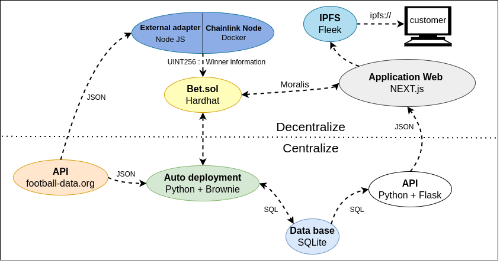
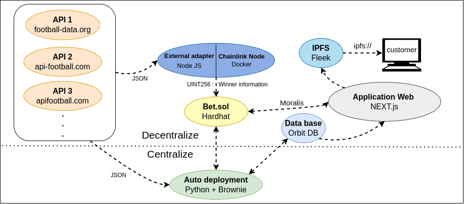

# Main repository for : decentralize-foot-bet

#### Key-words :

- Web3, EVM, Dapp
- Solidity, Node JS, Hardhat, Brownie, Openzepplin, Chainlink Node, External adapters, Chainlink Keeper, Ethers.js, Goerly
- React JS, Next JS, Moralis, Fleek, IPFS, web3uikit, Tailwindcss
- Python, Flask API, Docker

## How to bet ?

---

- Download [Metamask](https://metamask.io/)
- Get some ETH on [Goerli](https://goerlifaucet.com/)
- Go to one of these links:
  - HTTP :
  - IPFS :
- Connect your Metamask
- And bet on the match you want

## Introduction

---

BLABLABLALB

### Project structuring

# Table

I - [Bet Smart Contract](https://github.com/beirao/backend-decentralize-foot-bet)

II - [Chainlink External Adapter](https://github.com/beirao/chainlinkEA-decentralize-foot-bet)

III - [Auto Deployment Server](https://github.com/beirao/autoDeployment-decentralize-foot-bet)

IV - [API Flask](https://github.com/beirao/flaskAPI-decentralize-foot-bet)

V - [Frontend - Web Interface](https://github.com/beirao/frontend-decentralize-foot-bet)

## What can be done to improve the decentralization

- Make a consensus mechanism between severals foot APIs.

- Use [Orbit-DB ](https://github.com/orbitdb/orbit-db)istead of sqlite.
- With orbit-DB the api Flask can also be remove.

The auto deployment system don't need to be decentralize : because everyone can check is the Bet contract is corupted or not.

### The introduction schema full decentralize update

