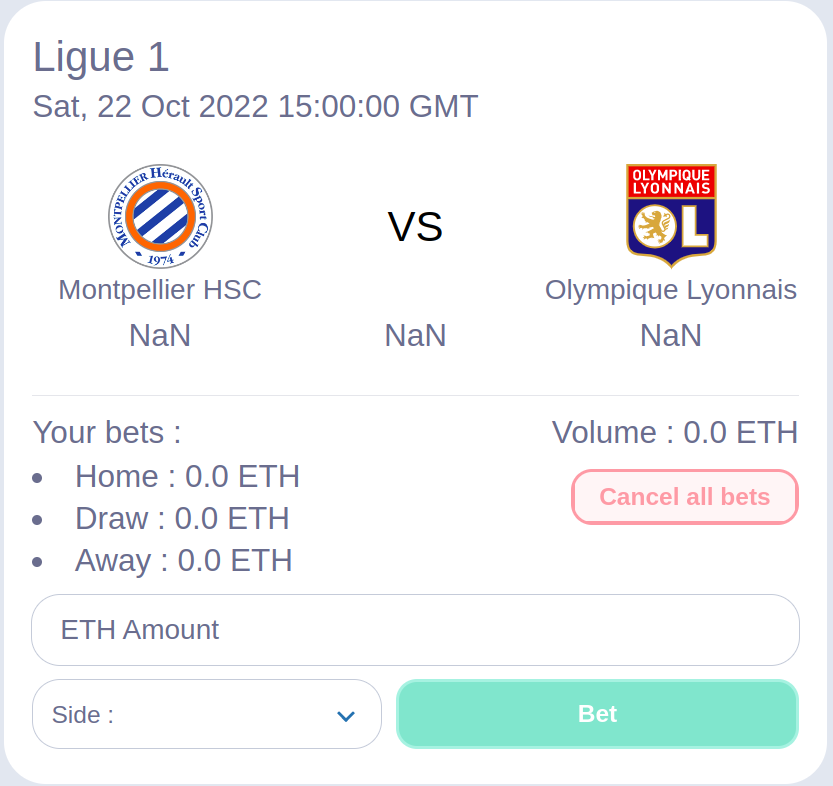
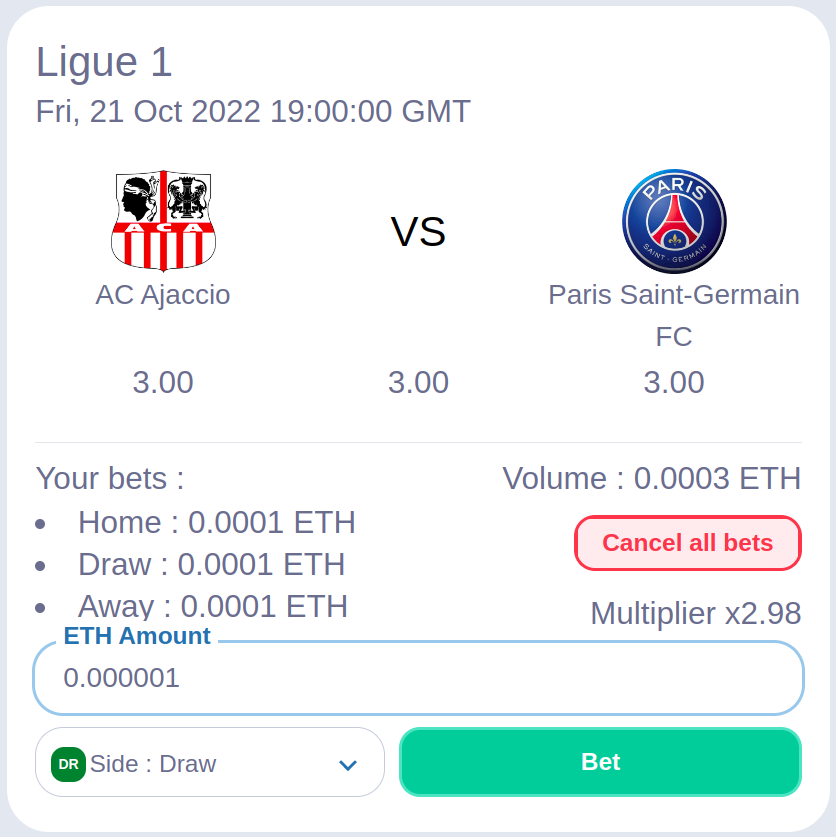

# BoarBet : a simple decentralized betting application

### ⚡ Live demo on : https://boarbet.beirao.me

### Key-words :

- Web3, EVM, Dapp
- Solidity, Node JS, Hardhat, Brownie, Openzepplin, Chainlink Node, External adapters, Chainlink Keeper, Ethers.js, Goerly
- React JS, Next JS, Moralis, web3uikit, Tailwindcss
- Python, Flask API, Docker

# Table

I - [Bet smart contract](https://github.com/beirao/backend-decentralize-foot-bet)

II - [Wrapped api for the Chainlink single word response](https://github.com/beirao/footApiWrap-decentralize-foot-bet)

III - [Auto Deployment Server](https://github.com/beirao/autoDeployment-decentralize-foot-bet)

IV - [API for the frontend](https://github.com/beirao/flaskAPI-decentralize-foot-bet)

V - [Centralized Keeper](https://github.com/beirao/keeper-decentralize-foot-bet)

VI - [Frontend - Web Interface](https://github.com/beirao/frontend-decentralize-foot-bet)

## How to bet ?

- Download [Metamask](https://metamask.io/)
- Get some ETH on [Goerli](https://goerlifaucet.com/)
- Go to [BoarBet](https://boarbet.beirao.me)
- Connect your Metamask on Goerli
- Chose a match
  - Select a side
  - Fill ETH amount
  - Click **Bet**
  - Valid the transaction on Metamask

## How does it work?

- You can only bet the main currency of the blockchain the contract is deployed on. Here **GoerliETH**.
- Just below the League there is the match timestamp. After this time you will not be allowed to bet anymore.
- By clicking on the league title you can access the smart contract on etherscan.
- The minimum bet value is **0.00001 ETH**.
- A 2% tax will be levied on the total volume of each valid bet.
- All sides must have a bet. If nobody bet on Home, Draw or Away everyone will be refunded.
- The odds are located just below their respective side.
- You can see how much you have already bet just below **Your bets**.
- If you made a mistake you can cancel all your bets on **Cancel all bets**.
- You can see the total **Volume** lock on the smart contract.
- By selecting a side and an amount you will be able to see the **Multiplier** of your bet at the time of the bet according to the volume and other people bets.

- Once the match started, wait 4 hours and if you had bet the right side you will be able to see your reward on the **/Rewards** page.

<!--  -->

## Warning

This decentralized bet application is a proof a concept with unaudited code and should not be use in production in its current state. The **Bet.sol** contract relied on the [football-data.org](https://www.football-data.org/) API. That make the result of each bet sensible to API attack.

The minimum will be to audit the code and make a consensus mechanism between severals foot APIs as explained in _The (almost) fully decentralized way_ part.

## Project structure

The main element is the **Bet.sol** contract. For each football match one of these contracts will be deployed. The contract know the match timestamp (to lock the betting phase when the match start) and the matchId (to call, once the match is ended, the api and know who is the winner).

To know who win the match, we need an API call in the contract. The best way to do this is by using a Chainlink [external adapters](https://docs.chain.link/docs/external-adapters/) hosted on a Chainlink node. But to make this POC a little less expensive I decide to use the simple Chainlink [single word response](https://docs.chain.link/docs/any-api/get-request/examples/single-word-response/) and wrap the [football-data.org](https://www.football-data.org/) API to make the response as simple as possible for the contract.
By the way, an [external adapter](https://github.com/beirao/chainlinkEA-decentralize-foot-bet) was developed but unuse because of the infastructure cost of a [Chainlink node](https://docs.chain.link/docs/running-a-chainlink-node/).

**Bet.sol** is a Chainlink keeper compatible contract. It means that after each match someone have to call the function _performUpKeep()_ to distribute rewards. The best way is to register the contract in the [keeper contract](https://automation.chain.link/) but for reduce the cost and because this part is not very critical (it doesn't matter if people receive their reward late, the money is safe anyway) I decide to make a personalise Keeper.

The **Auto deployment** part deploy all the contracts automatically.

The **API** help the frontend to display updated data.

## The (almost) fully decentralized way

Let's see how to improve decentralization : (Ranked by importance)

- For the foot API, we can make a consensus mechanism between severals foot APIs will make this part semi-decentralized and reduce the API attack risk.

- Firstly, we can make the winner information a lot more decentralized by using a Chainlink exteral adapter instead of current wrapped API that use the Chainlink single word response. This external adapter will need a Chainlink node to be hosted.

- By using the [self-automating keeper smart contracts](https://docs.chain.link/docs/chainlink-automation/register-upkeep/) a **BetDeployment.sol** contract will be able to deploy **Bet.sol** contract in a decentralized way. Unfortunately, this feature was in beta when I developed this dapp.

- Using [The Graph](https://thegraph.com/en/) for indexing will allow the deletion of the centralized database and API.

