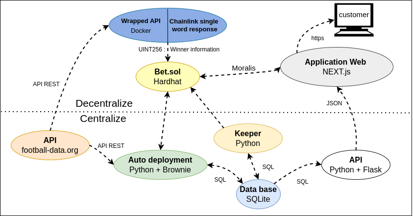
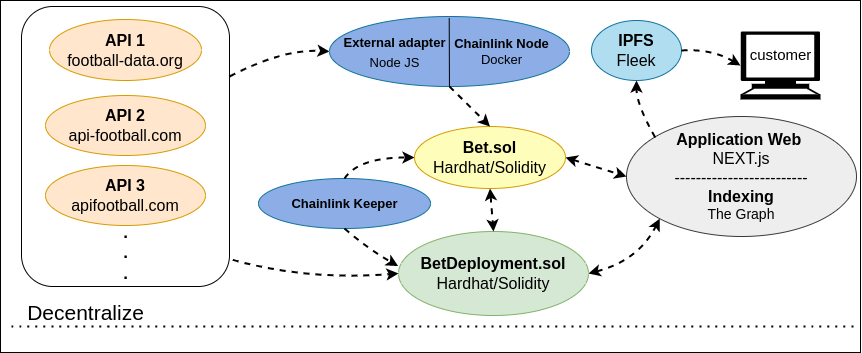

# BoarBet

#### Key-words :

- Web3, EVM, Dapp
- Solidity, Node JS, Hardhat, Brownie, Openzepplin, Chainlink Node, External adapters, Chainlink Keeper, Ethers.js, Goerly
- React JS, Next JS, Moralis, Fleek, IPFS, web3uikit, Tailwindcss
- Python, Flask API, Docker

# Table

I - [Bet smart contract](https://github.com/beirao/backend-decentralize-foot-bet)

II - [Wrapped api for the Chainlink single word response](https://github.com/beirao/footApiWrap-decentralize-foot-bet)

III - [Auto Deployment Server](https://github.com/beirao/autoDeployment-decentralize-foot-bet)

IV - [API for the frontend](https://github.com/beirao/flaskAPI-decentralize-foot-bet)

V - [Centralized Keeper](https://github.com/beirao/keeper-decentralize-foot-bet)

VI - [Frontend - Web Interface](https://github.com/beirao/frontend-decentralize-foot-bet)

## How to bet ?

- Download [Metamask](https://metamask.io/)
- Get some ETH on [Goerli](https://goerlifaucet.com/)
- Go to [BoarBet](https://boarbet.beirao.me)
- Connect your Metamask on Goerli
- Chose a match
  - Select a side
  - Fill ETH amount
  - Click **Bet**
  - Valid the transaction on Metamask

## How does it work?

- You can only bet the main currency of the blockchain the contract is deployed on. Here **GoerliETH**.
- Just below the League there is the match timestamp. After this time you will not be allowed to bet anymore.
- By clicking on the league title you can access the smart contract on etherscan.
- The minimum bet value is **0.00001 ETH**.
- All sides must have a bet. If nobody bet on Home, Draw or Away everyone will be refunded.
- The odds are located just below their respective side.
- You can see how much you have already bet just below **Your bets**.
- If you made a mistake you can cancel all your bets on **Cancel all bets**.
- You can see the total **Volume** lock on the smart contract.
- By selecting a side and an amount you will be able to see the **Multiplier** of your bet at the time of the bet according to the volume and other people bets.

- Once the match started, wait 4 hours and if you had bet the right side you will be able to see your reward on the **/Rewards** page.

<!--  -->

## Project structure

## The (almost) fully decentralized way

Let's see how to improve decentralization:

- For the foot API, make a consensus mechanism between severals foot APIs will make this part semi-decentralized and reduce the API attack risk.

- By using the [self-automating keeper smart contracts](https://docs.chain.link/docs/chainlink-automation/register-upkeep/) a **BetDeployment.sol** contract will be able to deploy **Bet.sol** contract in a decentralized way. Unfortunately, this feature was in beta when I developed this dapp.

- Using [The Graph](https://thegraph.com/en/) for indexing will allow the deletion of the centralized database and API.

